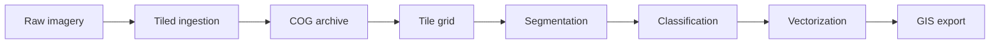

# Terra OBIA Architecture

Terra OBIA is an Object-Based Image Analysis (OBIA) platform designed to replace
Trimble eCognition for government and enterprise forestry workflows: stand
delineation, wetland classification, and land cover/land use (LULC) mapping at
province-scale extents.

This document describes the system design at the scaffolding stage. Processing
algorithms are not yet implemented; the focus is on modular boundaries, data
flow, and big-data handling strategy.

## Design goals

1. **Province-scale imagery** — Process rasters covering entire provinces without
   loading full datasets into memory.
2. **Workflow reuse** — Share segmentation and classification primitives across
   forestry, wetland, and carbon MRV products.
3. **Operational clarity** — Separate ingestion, compute, API, and export so
   teams can evolve each layer independently.
4. **Type safety and quality** — Enforce Python 3.11+, strict mypy, and ruff
   from the first commit.

## Monorepo layout

```
terra-OBIA/
├── core/           # Python engine: geospatial I/O, segmentation, classification
├── api/            # FastAPI service exposing the engine
├── pipeline/       # Ingestion, COG conversion, tiling, job orchestration
├── web/            # Dashboard placeholder (built later)
├── infra/          # Docker and Terraform placeholders
├── docs/           # Architecture, ADRs, API reference, user guides
└── tests/          # Cross-package integration and unit tests
```

### Module responsibilities

| Module | Responsibility | Depends on |
|--------|----------------|------------|
| `core` | Geospatial I/O (COG window reads), segmentation interfaces, classification interfaces | GDAL/rasterio stack |
| `pipeline` | Raw → COG ingestion, spatial tiling, job orchestration | `core` |
| `api` | REST endpoints, request validation, job status | `pipeline`, `core` |
| `web` | Operator dashboard (future) | `api` |
| `infra` | Containers, cloud resources, deployment | all services |

Each module is a separate Python package (`terra_core`, `terra_pipeline`,
`terra_api`) managed by a single root `pyproject.toml`.

## Why Cloud-Optimized GeoTIFFs and tiled processing

Province-scale airborne or satellite mosaics routinely exceed available RAM.
A single 50 cm orthomosaic covering a large forestry management unit can be
hundreds of gigabytes uncompressed. Loading entire rasters into memory—as
classical desktop OBIA tools often assume—is not viable at this scale.

**Cloud-Optimized GeoTIFFs (COG)** address this by design:

- **Internal tiling** — Pixel data is organized in fixed-size blocks (typically
  512×512) so readers fetch only the bytes needed for a spatial window.
- **Internal overviews** — Pyramid levels enable efficient preview and
  multi-resolution workflows without separate sidecar files.
- **HTTP range requests** — COGs stored on object storage (S3, Azure Blob, GCS)
  support partial reads, so workers pull tiles on demand rather than copying
  whole files locally.
- **Predictable I/O** — Windowed reads map directly to processing tiles,
  making parallelization and cost estimation straightforward.

Terra OBIA standardizes on COG as the internal raster format after ingestion.
The `pipeline` module converts raw GeoTIFFs to COG; the `core` module reads
COG windows; workers never materialize full province mosaics in memory.

### Tiled processing model

Processing proceeds in spatial tiles aligned to the COG block structure:

1. A `TileGrid` computes pixel windows with configurable overlap (for stitching
   segmentation outputs at tile boundaries).
2. Each worker reads one window via `CogReader.read_window`.
3. Segmentation and classification run on the tile array.
4. Results are merged, vectorized, and written to export formats.

Overlap and tile size are workflow parameters stored in job configuration, not
hard-coded in the engine.

## Data flow

End-to-end processing for a typical forestry stand delineation job:



| Stage | Module | Output |
|-------|--------|--------|
| Raw imagery | External source | GeoTIFF, JPEG2000, or vendor format |
| Tiled ingestion | `pipeline` | Valid COG with internal tiles and overviews |
| Segmentation | `core` | Per-tile label or instance masks |
| Classification | `core` | Thematic class per segment/object |
| Vectorization | `core` (future) | GeoJSON, GeoPackage, or Shapefile features |
| GIS export | `pipeline` (future) | Deliverables for ArcGIS, QGIS, or enterprise GDB |

The API accepts a job request (`source_uri`, `workflow`), delegates to the
orchestrator, and exposes status endpoints. The web dashboard (future) will
consume the same API.

## Decoupled module design

Modules communicate through narrow interfaces, not shared global state:

- **`CogReader`** (`core`) — Windowed raster I/O; no knowledge of workflows.
- **`SegmentationModel` / `ClassificationModel`** (`core`) — Algorithm
  contracts; no knowledge of storage or HTTP.
- **`CogConverter` / `TileGrid`** (`pipeline`) — Format and spatial
  partitioning; no embedded ML logic.
- **`JobRunner`** (`pipeline`) — Wires stages together from workflow config.

This separation enables future products without rewriting ingestion or export:

| Future workflow | Reuses | Swaps |
|-----------------|--------|-------|
| Wetland classification | Ingestion, tiling, export | Wetland-specific classifier |
| Carbon MRV | Segmentation core, tiling | Biomass estimation features |
| LULC mapping | Full pipeline skeleton | Multi-class taxonomy and training data |

Adding a workflow means registering a configuration that names concrete
implementations of the core interfaces—not forking the repository.

## Technology choices

| Concern | Choice | Rationale |
|---------|--------|-----------|
| Language | Python 3.11+ | Geospatial ecosystem (rasterio, GDAL, geopandas) |
| Dependencies | Poetry | Reproducible lockfile, monorepo-friendly |
| API | FastAPI | Async-ready, OpenAPI docs, pydantic validation |
| Linting | Ruff | Fast, replaces flake8/isort |
| Typing | mypy (strict) | Catch CRS/resolution contract violations early |
| CI | GitHub Actions | Lint, type-check, test on every push |

See `/docs/decisions/` for Architecture Decision Records (ADRs) on COG/tiling
and learned segmentation vs. classical multiresolution segmentation.

## Current status

This repository is **scaffolding only**. Placeholder classes raise
`NotImplementedError` for COG I/O, conversion, and job orchestration.
Interfaces, tests, documentation, and CI are in place so feature work can
proceed incrementally with consistent quality gates.

## Related documentation

- [ADR-0001: COG and tiled processing](./decisions/ADR-0001-cog-tiled-processing.md)
- [ADR-0002: Learned segmentation over multiresolution segmentation](./decisions/ADR-0002-learned-segmentation.md)
- [CONTRIBUTING.md](../CONTRIBUTING.md) — Documentation and PR standards
