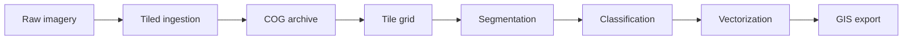

# Terra OBIA Architecture

Terra OBIA is an Object-Based Image Analysis (OBIA) platform designed to replace
Trimble eCognition for government and enterprise forestry workflows: stand
delineation, wetland classification, and land cover/land use (LULC) mapping at
province-scale extents.

This document describes the Terra OBIA system design, module boundaries, and
data flow. See **Current status** below for what is implemented today versus
planned work.

## Design goals

1. **Province-scale imagery** — Process rasters covering entire provinces without
   loading full datasets into memory.
2. **Workflow reuse** — Share segmentation and classification primitives across
   forestry, wetland, and carbon MRV products.
3. **Operational clarity** — Separate ingestion, compute, API, and export so
   teams can evolve each layer independently.
4. **Type safety and quality** — Enforce Python 3.11+, strict mypy, and ruff
   from the first commit.

## Monorepo layout

```
terra-OBIA/
├── core/           # Python engine: geospatial I/O, segmentation, classification
├── api/            # FastAPI service exposing the engine
├── pipeline/       # Ingestion, COG conversion, tiling, ETL, job orchestration
├── web/            # React review dashboard (MapLibre, Tailwind)
├── infra/          # Docker and Terraform placeholders
├── docs/           # Architecture, ADRs, API reference, user guides
└── tests/          # Cross-package integration and unit tests
```

### Module responsibilities

| Module | Responsibility | Depends on |
|--------|----------------|------------|
| `core` | Geospatial I/O (COG window reads), segmentation interfaces, classification interfaces | GDAL/rasterio stack |
| `pipeline` | Ingestion (COG/GeoTIFF/Sentinel-2), spatial tiling, SQLite tile catalog, ETL, validation, job orchestration | `core` |
| `api` | REST endpoints, job orchestration, GIS export delivery | `pipeline`, `core` |
| `web` | Analyst review dashboard — map viewer, corrections, job monitoring, exports | `api` |
| `infra` | Containers, cloud resources, deployment | all services |

Each module is a separate Python package (`terra_core`, `terra_pipeline`,
`terra_api`) managed by a single root `pyproject.toml`.

## Why Cloud-Optimized GeoTIFFs and tiled processing

Province-scale airborne or satellite mosaics routinely exceed available RAM.
A single 50 cm orthomosaic covering a large forestry management unit can be
hundreds of gigabytes uncompressed. Loading entire rasters into memory—as
classical desktop OBIA tools often assume—is not viable at this scale.

**Cloud-Optimized GeoTIFFs (COG)** address this by design:

- **Internal tiling** — Pixel data is organized in fixed-size blocks (typically
  512×512) so readers fetch only the bytes needed for a spatial window.
- **Internal overviews** — Pyramid levels enable efficient preview and
  multi-resolution workflows without separate sidecar files.
- **HTTP range requests** — COGs stored on object storage (S3, Azure Blob, GCS)
  support partial reads, so workers pull tiles on demand rather than copying
  whole files locally.
- **Predictable I/O** — Windowed reads map directly to processing tiles,
  making parallelization and cost estimation straightforward.

Terra OBIA standardizes on COG as the internal raster format after ingestion.
The `pipeline` module converts raw GeoTIFFs to COG; the `core` module reads
COG windows; workers never materialize full province mosaics in memory.

### Tiled processing model

Processing proceeds in spatial tiles with configurable overlap (default 1024×1024
px windows, 64 px overlap):

1. `TileIngestionPipeline` ingests COG, GeoTIFF, or Sentinel-2 SAFE sources and
   validates geospatial metadata.
2. A `TileGrid` computes pixel windows and writes STAC-like records to a SQLite
   `TileCatalog`.
3. `StreamingTileReader` lazily reads one tile window at a time via rasterio.
4. The pure `process_tile(profile, tile)` function handles each tile independently
   (parallelizable by Dask/Ray later).
5. Segmentation and classification run on tile arrays in `terra_core`.
6. Results are merged, vectorized, and written to export formats via `terra_core.export`.

Overlap and tile size are workflow parameters stored in job configuration, not
hard-coded in the engine. See [pipeline.md](./pipeline.md) for ingestion and
catalog details.

## Data flow

End-to-end processing for a typical forestry stand delineation job:



| Stage | Module | Output |
|-------|--------|--------|
| Raw imagery | External source | GeoTIFF, JPEG2000, or vendor format |
| Tiled ingestion | `pipeline` | Valid COG with internal tiles and overviews |
| Segmentation | `core` | Per-tile label raster, object features, tile merge |
| Classification | `core` | Thematic class per segment/object |
| Vectorization | `core` | GeoJSON, GeoPackage, or Shapefile features (via segmentation module) |
| GIS export | `core` / `api` | GeoJSON, GeoPackage, Shapefile deliverables |

The API accepts a job request (`source_uri`, `workflow`), delegates to the
orchestrator, and exposes status endpoints. The React review dashboard in
`/web` consumes the same API for job monitoring, segment review, corrections,
and export downloads (see `docs/dashboard.md`).

## Decoupled module design

Modules communicate through narrow interfaces, not shared global state:

- **`CogReader`** (`core`) — Windowed raster I/O; no knowledge of workflows.
- **`SegmentationModel`** (`core`) — Pluggable tile segmenters (SLIC classical,
  FCN deep learning) producing label rasters and object features; includes
  overlap-aware mosaic merge.
- **`ClassificationModel`** (`core`) — Pluggable object classifiers; stand
  delineation workflow implemented with versioned gradient boosting models,
  accuracy reporting, and audit logging.
- **`CogConverter` / `TileGrid` / `TileCatalog` / `StreamingTileReader`** (`pipeline`) — Format conversion, spatial partitioning, catalog persistence, and lazy I/O; no embedded ML logic.
- **`process_tile`** (`pipeline`) — Pure per-tile task function for local or distributed execution.
- **`JobRunner`** (`pipeline`) — Wires stages together from workflow config.

This separation enables future products without rewriting ingestion or export:

| Future workflow | Reuses | Swaps |
|-----------------|--------|-------|
| Wetland classification | Ingestion, tiling, export | Wetland-specific classifier |
| Carbon MRV | Segmentation core, tiling | Biomass estimation features |
| LULC mapping | Full pipeline skeleton | Multi-class taxonomy and training data |

Adding a workflow means registering a configuration that names concrete
implementations of the core interfaces—not forking the repository.

## Technology choices

| Concern | Choice | Rationale |
|---------|--------|-----------|
| Language | Python 3.11+ | Geospatial ecosystem (rasterio, GDAL, geopandas) |
| Dependencies | Poetry | Reproducible lockfile, monorepo-friendly |
| API | FastAPI | Async-ready, OpenAPI docs, pydantic validation |
| Linting | Ruff | Fast, replaces flake8/isort |
| Typing | mypy (strict) | Catch CRS/resolution contract violations early |
| CI | GitHub Actions | Lint, type-check, test on every push |

See `/docs/decisions/` for Architecture Decision Records (ADRs) on COG/tiling
and learned segmentation vs. classical multiresolution segmentation.

## Current status

See **[Implementation Status](./IMPLEMENTATION_STATUS.md)** for the authoritative
component matrix (status, test evidence, last verified date). At a glance:

- **Implemented:** pipeline ingestion/tiling, SLIC classical segmenter, tile merge,
  gradient-boosting stand classifier (train + inference), REST API with GIS export
  and analyst review, web dashboard, ETL utilities.
- **Partial:** deep segmenter runs FCN-ResNet50 inference with COCO-pretrained
  weights — functional baseline, not forestry-fine-tuned.
- **Not started:** `terra_core.CogReader` (pipeline/API use rasterio directly),
  `pipeline.JobRunner` orchestration stub, production `infra/`.

Module docs: [pipeline.md](./pipeline.md), [etl.md](./etl.md),
[segmentation.md](./segmentation.md), [classification.md](./classification.md),
[api.md](./api.md), [dashboard.md](./dashboard.md).

## Related documentation

- [Implementation status](./IMPLEMENTATION_STATUS.md)
- [Pipeline module](./pipeline.md)
- [ETL & training data](./etl.md)
- [Segmentation module](./segmentation.md)
- [Classification module](./classification.md)
- [API reference](./api.md)
- [ADR-0001: COG and tiled processing](./decisions/ADR-0001-cog-tiled-processing.md)
- [ADR-0002: Learned segmentation over multiresolution segmentation](./decisions/ADR-0002-learned-segmentation.md)
- [CONTRIBUTING.md](../CONTRIBUTING.md) — Documentation and PR standards
