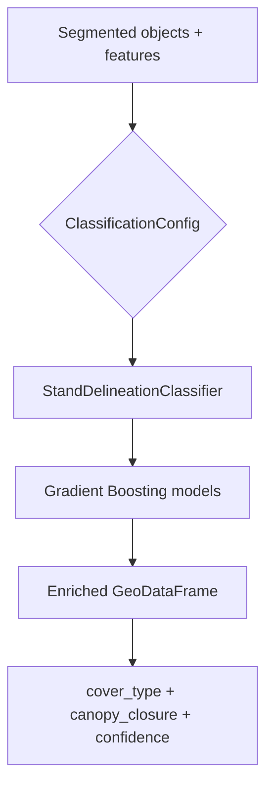

# Terra OBIA Classification

The `terra_core.classification` module assigns thematic attributes to segmented
objects — the second stage of OBIA after segmentation. The first production
workflow is **automated forest stand delineation**, replacing manual stand
attribution in Trimble eCognition for government forestry customers (e.g. NB
DNRED).

## Design overview



Every workflow implements the same `ClassificationModel` interface so wetland,
LULC, and species classification can be added without changing pipeline or API
boundaries.

## Stand delineation workflow

1. **Segment** province-scale imagery into objects (`terra_core.segmentation`)
2. **Extract features** — spectral means/stds, area, perimeter, compactness
3. **Classify** each object with a trained model:
   - `cover_type` — dominant cover (conifer, deciduous, mixed, …)
   - `canopy_closure_class` — open / sparse / moderate / dense
   - `confidence` — minimum predicted probability across both model heads
4. **Review** objects where `confidence < min_confidence` (default 0.5)

### Example inference

```python
from terra_core.classification import ClassificationConfig, create_classifier

classifier = create_classifier(
    ClassificationConfig(model_artifact_path="models/stand_geonb_v1_balanced")
)
result = classifier.classify_objects(segmentation_result.objects)
print(result.objects[["object_id", "cover_type", "canopy_closure_class", "confidence"]])
```

## ETL → OBIA model handoff

Trained GeoNB stand classifiers live in **terra-obia-etl**
(`models/stand_geonb_v1_balanced/`). terra-OBIA does not commit those weights.
Register them with one command (sibling checkout assumed):

```bash
# From terra-OBIA, with ../terra-obia-etl present
poetry run terra-register-etl-model
```

This symlinks (or `--mode copy`) the ETL artifact into `models/` so
`GET /v1/models` and job submission can resolve `model_id`. Then predict:

```bash
poetry run terra-predict-stands path/to/objects.gpkg \
  --model-dir models/stand_geonb_v1_balanced \
  --output predictions.gpkg
```

Integration coverage: `tests/test_etl_model_handoff.py` (loads the real ETL
artifact and asserts cover_type + canopy_closure predictions).
CI checks out the ETL model directory sparsely so the handoff test runs in Actions.

## Classifier backend

The default backend is **scikit-learn Gradient Boosting** trained on per-object
feature vectors. This mirrors eCognition's object feature + classifier pattern
while remaining fast, interpretable, and easy to audit.

| Property | Gradient Boosting (current) | Deep model (future) |
|----------|----------------------------|---------------------|
| Input | Tabular object features | Features + optional patch tensors |
| Training data | CSV / GeoPackage of labeled stands | Same + imagery patches |
| Auditability | Feature importances, versioned joblib | Model weights + metadata |

The `ClassifierBackend.DEEP` enum value is reserved; implement a new
`ClassificationModel` subclass when ready.

## Training / retraining

### Labeled dataset format

Training data is a **CSV** or **GeoPackage** with:

| Column | Required | Description |
|--------|----------|-------------|
| `cover_type` | Yes | Dominant cover class label |
| `canopy_closure_class` | Yes | Canopy closure bin |
| `area_m2`, `perimeter_m`, `compactness` | Recommended | Shape metrics |
| `mean_band_*`, `std_band_*` | Recommended | Spectral features from segmentation |
| `geometry` | GeoPackage only | Stand polygon for IoU evaluation |

Expected CRS/resolution: features must be computed at the same GSD and band
ordering used during production inference.

### Training script

```bash
poetry run terra-train-stand-classifier \
  data/nb_labeled_stands.gpkg \
  --output-dir models/stand_v20250620 \
  --description "NB DNRED 2025 photo-interpreted stand samples" \
  --report-path reports/stand_v20250620_accuracy.md
```

Or programmatically:

```python
from terra_core.classification import TrainingConfig, train_stand_classifier, load_labeled_dataset

artifact = train_stand_classifier(
    load_labeled_dataset("data/nb_labeled_stands.csv"),
    TrainingConfig(training_data_description="NB 2025 stands"),
    output_dir="models/stand_v20250620",
)
print(artifact.metadata.validation_metrics)
```

## Model versioning and audit metadata

Every trained model is saved as a directory:

```
models/stand_v20250620/
  metadata.json              # audit record
  cover_type_model.joblib
  canopy_closure_model.joblib
  accuracy_report.md         # written by training script
```

`metadata.json` includes:

- `model_id` — unique identifier (e.g. `stand_20250620T120000Z_a1b2c3d4`)
- `training_date` — ISO 8601 UTC timestamp
- `training_data_description` — human-readable provenance
- `validation_metrics` — held-out accuracy from training split
- `feature_columns`, class lists, sklearn version

Structured JSON logs are emitted on save, load, train, and classify for
government audit trails.

## Accuracy reporting

Given a held-out labeled set, `evaluation.py` computes:

| Metric | Level | Purpose |
|--------|-------|---------|
| Overall accuracy | Object | Combined cover + canopy correctness |
| Precision / recall / F1 | Object, per class | Class-specific performance |
| Polygon IoU | Spatial, per cover type | Boundary agreement vs manual delineation |

Reports are written as **Markdown** suitable for sales evidence:

> "87% object-level accuracy, 82% mean polygon IoU vs manual eCognition
> delineation."

```python
from terra_core.classification import write_accuracy_report_markdown

write_accuracy_report_markdown(report, "reports/validation.md", model_id="stand_v1")
```

## Interpreting confidence scores

`confidence` is the **minimum** of the max predicted probabilities from the
cover-type and canopy-closure models. It ranges from 0 to 1:

| Range | Analyst action |
|-------|----------------|
| ≥ 0.8 | High confidence — suitable for automated acceptance |
| 0.5 – 0.8 | Moderate — spot-check recommended |
| < 0.5 (`needs_review=True`) | Low — manual photo-interpretation advised |

Confidence reflects **classifier certainty given extracted features**, not
overall product accuracy. Always cross-reference with the validation report
for workflow-level accuracy claims.

## Adding a new workflow

1. Add a `ClassificationWorkflow` enum value
2. Subclass `ClassificationModel`
3. Implement `classify_objects()`
4. Register in `factory.create_classifier()`
5. Add training script / dataset schema docs
6. Add tests under `tests/test_classification.py`

## Related documentation

- [Segmentation module](./segmentation.md)
- [Architecture overview](./architecture.md)
- [ADR-0002: Learned segmentation](./decisions/ADR-0002-learned-segmentation.md)
