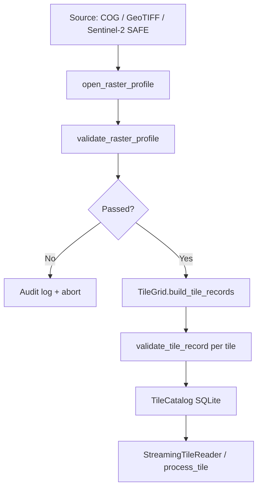

# Terra OBIA Pipeline

The `terra_pipeline` package ingests province-scale raster imagery, validates
geospatial metadata, splits sources into overlapping processing tiles, and
persists STAC-like tile records in a local SQLite catalog. It is designed for
NB DNRED-scale forestry and wetland workflows where loading an entire mosaic into
memory is not viable.

## Overview



## Supported input formats

| Format | Detection | Notes |
|--------|-----------|-------|
| Cloud-Optimized GeoTIFF (COG) | `.tif`/`.tiff` with COG layout or overviews | Preferred internal format |
| GeoTIFF | `.tif`/`.tiff` without COG layout | May be converted to COG via `CogConverter` |
| Sentinel-2 SAFE | `.SAFE` directory with `IMG_DATA/R10m/*.jp2` | Multi-band JP2 (or GeoTIFF in tests) stacked at read time |

Ingestion uses **rasterio** for metadata and windowed reads and **rioxarray**
for optional `xarray`/`dask`-ready tile access.

## Ingestion flow

1. **Detect format** — `detect_raster_format()` inspects path layout.
2. **Open profile** — `open_raster_profile()` reads CRS, resolution, dimensions,
   nodata, and band list without loading pixels.
3. **Validate source** — `validate_raster_profile()` checks CRS, dimensions,
   resolution, and nodata; results are JSON-logged for audit trails.
4. **Validate bands** — For Sentinel-2 SAFE, all JP2 bands must share CRS,
   resolution, and dimensions.
5. **Generate tiles** — `TileGrid` computes overlapping windows and builds
   `TileRecord` entries with geotransform and bounding box.
6. **Validate tiles** — Each tile is checked against the parent profile; unreadable
   windows are flagged before processing.
7. **Persist catalog** — STAC-like Items are written to SQLite via `TileCatalog`.

### Example

```python
from terra_pipeline import TileIngestionPipeline

pipeline = TileIngestionPipeline(
    tile_size=1024,
    overlap=64,
    catalog_path="outputs/tiles.db",
)
result = pipeline.run("data/nb_forest_mosaic.tif", source_id="nb_forest")
print(f"{len(result.tiles)} tiles ready")
```

## Tiling strategy

### Defaults

- **Tile size:** 1024 × 1024 pixels
- **Overlap:** 64 pixels on each internal edge
- **Step:** 960 pixels (`tile_size - overlap`)

### Why overlap is required

Segmentation models (especially convolutional networks) produce unreliable
predictions near tile edges where spatial context is truncated. When province-scale
mosaics are split into tiles, stand boundaries and wetland edges frequently fall
on tile borders.

Overlap ensures:

1. **Context buffer** — Each tile shares a 64 px border with its neighbour, giving
   the model access to adjacent pixels during inference.
2. **Stitching margin** — Downstream merge logic can discard edge bands and keep
   central regions, reducing seam artifacts.
3. **Consistent objects** — Objects spanning tile boundaries appear whole in at
   least one overlapping window.

Edge tiles along the raster boundary may be smaller than 1024 px when the extent
is not an exact multiple of the step size. The grid still covers the full extent.

### Tile indexing

Each tile receives:

- `tile_row`, `tile_col` — zero-based grid indices
- `tile_id` — `{source_id}_{row}_{col}`
- Pixel window — `col_off`, `row_off`, `width`, `height`
- Georeferencing — per-tile `transform` and `bbox` in the source CRS

## Streaming reads

`StreamingTileReader` never loads a full province mosaic. It:

- Opens the source (or each Sentinel-2 band) on demand
- Reads one `rasterio.windows.Window` at a time
- Yields `TileData` arrays with shape `(bands, height, width)`
- Optionally returns `xarray.DataArray` via `read_tile_xarray()` with rioxarray
  CRS metadata and dask chunks sized to the tile

```python
from terra_pipeline import StreamingTileReader, TileCatalog

with TileCatalog("outputs/tiles.db") as catalog:
    tiles = catalog.list_tiles(source_uri="data/mosaic.tif")
    reader = StreamingTileReader(result.profile)
    for tile_data in reader.iter_tiles(tiles):
        process(tile_data)  # one tile in memory at a time
```

## Catalog schema

`TileCatalog` stores STAC 1.0.0-like Item records in SQLite.

### `tile_items` table

| Column | Description |
|--------|-------------|
| `id` | Tile identifier (`{source_id}_{row}_{col}`) |
| `stac_version` | Always `1.0.0` |
| `type` | Always `Feature` |
| `source_uri` | Parent raster path or SAFE directory |
| `tile_row`, `tile_col` | Grid indices |
| `geometry` | GeoJSON polygon in source CRS |
| `bbox` | `[west, south, east, north]` |
| `properties` | JSON: transform, CRS, resolution, nodata, band count, dtype, tile_size, overlap, pixel window |
| `assets` | JSON: `{ "source": { "href": "...", "roles": ["data"] } }` |
| `created_at` | ISO 8601 UTC timestamp |

### `validation_logs` table

| Column | Description |
|--------|-------------|
| `source_uri` | Validated source |
| `tile_id` | Optional tile reference |
| `severity` | `error` or `warning` |
| `code` | Machine-readable code (e.g. `CRS_MISSING`) |
| `message` | Human-readable description |
| `created_at` | ISO 8601 UTC timestamp |

Validation logs complement JSON structured logging from `ValidationAuditLogger`
for government audit trails.

## Validation

| Code | Severity | Meaning |
|------|----------|---------|
| `CRS_MISSING` | error | Raster has no CRS |
| `INVALID_DIMENSIONS` | error | Zero or negative width/height |
| `NO_BANDS` | error | Zero bands reported |
| `INVALID_RESOLUTION` | error | Non-positive pixel size |
| `NODATA_UNDEFINED` | warning | Nodata not set on source |
| `COG_NOT_TILED` | warning | COG detected but tiling flag unset |
| `BAND_CRS_MISMATCH` | error | Sentinel-2 bands disagree on CRS |
| `TILE_CRS_MISMATCH` | error | Tile CRS differs from source |
| `TILE_UNREADABLE` | error | Window read probe failed |

## Distributed execution (future)

Tile processing is intentionally **pure and stateless**:

```python
from terra_pipeline import process_tile

# Local
result = process_tile(profile, tile)

# Future Dask
# results = dask.delayed(process_tile)(profile, tile)

# Future Ray
# @ray.remote
# def remote_process(profile, tile): return process_tile(profile, tile)
```

`process_tile(profile, tile)` accepts all inputs explicitly, performs a windowed
read, and returns a `TileProcessingResult` without mutating shared state. The same
interface supports single-machine dev/demo runs and future Dask/Ray cluster
scheduling without code changes.

## Module map

| Module | Responsibility |
|--------|----------------|
| `ingestion/` | Format detection, profile extraction, COG conversion |
| `tiling/` | Grid math, SQLite catalog, streaming reader |
| `validation/` | CRS/resolution/nodata checks, audit logging |
| `processing/` | Stateless per-tile task functions |
| `ingest.py` | `TileIngestionPipeline` orchestrator |

## Related documentation

- [Architecture overview](./architecture.md)
- [ADR-0001: COG and tiled processing](./decisions/ADR-0001-cog-tiled-processing.md)
- [CONTRIBUTING.md](../CONTRIBUTING.md)
