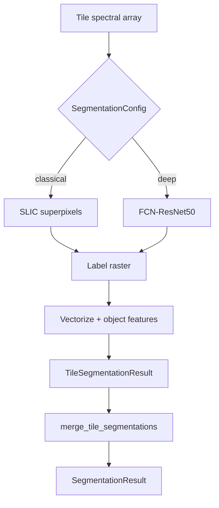

# Terra OBIA Segmentation

The `terra_core.segmentation` module replaces Trimble eCognition multiresolution
segmentation with a pluggable, learned-first approach suitable for province-scale
forestry and wetland OBIA workflows (e.g. NB DNRED stand delineation).

## Design overview



Every backend implements the same `SegmentationModel` interface and returns:

1. **Label raster** — `(height, width)` int32 array; `0` = background/nodata
2. **Object GeoDataFrame** — polygons with eCognition-style attributes:
   - Spectral: `mean_band_*`, `std_band_*`
   - Shape: `area_m2`, `perimeter_m`, `compactness`

## Algorithm choices

### Primary path: deep learning (FCN-ResNet50)

Terra OBIA uses a **pretrained FCN-ResNet50** semantic segmenter as the default
backend (`SegmentationBackend.DEEP`). Rationale:

| Factor | FCN-ResNet50 | eCognition MRS |
|--------|--------------|----------------|
| Reproducibility | Versioned weights + logged thresholds | Manual scale/shape/color tuning |
| Tile parallelism | Stateless GPU inference per tile | Desktop-bound region merging |
| Transfer learning | Fine-tune encoder on forestry mosaics | Limited ML integration |

**Input assumptions:**

- At least one spectral band; first three bands map to RGB for the ImageNet encoder
- Native GSD (typically 0.5–10 m for aerial/ Sentinel-2 10 m stacks)
- Additional bands are ignored until forestry fine-tuning is implemented

**Parameters:**

- `confidence_threshold` (default `0.5`) — pixels below max softmax probability become background

**Future work:** Segment Anything Model (SAM) will be added as an alternative
`SegmentationModel` backend for prompt-based instance segmentation.

### Baseline path: classical SLIC

`ClassicalSegmenter` uses **scikit-image SLIC** superpixels for:

- Comparison against eCognition-style workflows
- Environments without GPU / torch
- Regression testing and algorithm benchmarking

**Parameters (logged with every run):**

| Parameter | Role | eCognition analogue |
|-----------|------|---------------------|
| `n_segments` | Target superpixel count | Scale |
| `compactness` | Spectral vs spatial balance | Shape/compactness |
| `sigma` | Pre-smoothing Gaussian sigma | Smoothing |

## Internal representation

```python
from terra_core.segmentation import (
    SegmentationConfig,
    create_segmenter,
    merge_tile_segmentations,
)

config = SegmentationConfig.classical(n_segments=200, compactness=12.0)
segmenter = create_segmenter(config)
tile_result = segmenter.segment_tile(
    data,               # (bands, H, W) float at native GSD
    tile_id="nb_0_1",
    tile_row=0,
    tile_col=1,
    col_off=960,
    row_off=0,
    transform=tile_transform,
)
```

`TileSegmentationResult` fields:

| Field | Description |
|-------|-------------|
| `label_raster` | Per-pixel object IDs |
| `objects` | GeoDataFrame with geometry + features |
| `config_snapshot` | JSON-serializable parameters for audit |

## Tile-boundary merging

Province-scale mosaics are processed in overlapping tiles (default 64 px overlap
from the pipeline). Without explicit merge logic, objects are split at seams —
a common failure mode in tiled OBIA.

### Ownership-weighted merge

`merge_tile_segmentations()` reconciles overlap regions using **interior
ownership weighting**:

1. For each tile, compute a per-pixel weight = distance to nearest tile edge
2. Mosaic border edges are exempt (outer tiles keep full extent)
3. For each global pixel, select the label from the tile with highest weight
4. Break ties by preferring the numerically smaller label
5. Re-vectorize the merged label raster for global object statistics

```python
from terra_core.segmentation import MergeContext, merge_tile_segmentations

context = MergeContext(
    full_width=25000,
    full_height=18000,
    overlap=64,
    transform=mosaic_transform,
    crs_wkt=crs_wkt,
    pixel_area_m2=100.0,  # 10 m GSD
)
merged = merge_tile_segmentations(tile_results, context, data_by_tile, band_names=config.band_names)
```

### Validation helpers

- `validate_merge_coverage()` — ensures no valid pixels are unlabeled after merge
- `detect_duplicate_overlap_objects()` — flags duplicate polygons (IoU > 0.5) near seams

## Reproducibility logging

Every `segment_tile()` call emits structured JSON via `terra_core.segmentation`:

```json
{
  "event": "segmentation_run",
  "tile_id": "nb_0_1",
  "backend": "classical",
  "parameters": {
    "backend": "classical",
    "n_segments": 200,
    "compactness": 12.0,
    "sigma": 1.0
  }
}
```

Government customers can correlate delineation outputs with logged parameters
for audit and reproduction.

## Adding a new backend

1. Subclass `SegmentationModel` in `core/terra_core/segmentation/`
2. Implement `segment_tile()` returning `TileSegmentationResult`
3. Call `vectorize_labels()` to build the standard GeoDataFrame
4. Log parameters via `log_segmentation_run()`
5. Register in `factory.create_segmenter()`
6. Add `SegmentationBackend` enum value and config fields
7. Document input band/resolution assumptions in the class docstring
8. Add tests under `tests/test_segmentation.py`

Example skeleton:

```python
class SamSegmenter(SegmentationModel):
    """SAM-based segmenter (future)."""

    def segment_tile(self, data, *, tile_id, tile_row, tile_col, col_off, row_off, transform, nodata=None):
        labels = ...  # (H, W) int32
        objects = vectorize_labels(labels, data, transform, crs_wkt=None, band_names=self.config.band_names)
        return TileSegmentationResult(...)
```

## Related documentation

- [Architecture overview](./architecture.md)
- [Pipeline module (tiling/overlap)](./pipeline.md)
- [ADR-0002: Learned segmentation](./decisions/ADR-0002-learned-segmentation.md)
